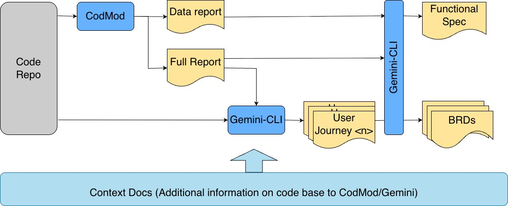
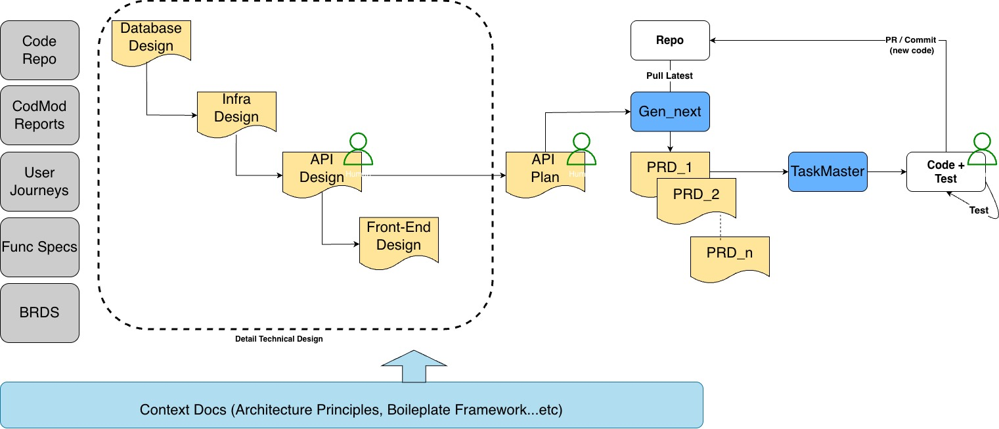

# Code to Code - Proof of Concept

PoC for a Code-2-Code solution based on Google tools.

The solution :
* Reads in an existing codebase
* Writes functional documentation 
* Writes new code based on the functional documentation

We are not transforming code from one language to another, instead we are re-building the app by documenting the existing codebase and rebuilding the code from documentation. 

This approach means that the solution:

* Builds out documentation from code for human (and agent) consumption
* Allows for major re-architecture and code level changes with Human intervention
* Produces design documents that can be reviewed and changed before execution
* Creates a plan for execution that is broken into phases
* Allows for re-writing of business logic and design

## Demo

[![Watch the video]](https://youtu.be/SwrSkUDiE90)


## Design Tenets

* We aim to automate as much as possible - but
* We start with automating small steps, and graduate to larger steps when they make sense.
  * Where automation is not feasible we fallback to manual steps
* The solution must be modular and accomodate different tools as the tooling in the space evolves. We will use the best fit tools for the job.

## Design Decisions

* The documentation is in markdown format. This format is ideal for agent/LLM consumption, and can be easily made human readable.
* The documentation is broken into chunks -- e.g. instead of producing a single big API design document, we produce 4 markdown files that breakdown design, dependencies, definition and implementation plan. This enables the tools to easily consume the documents into their context windows.
* Currently we use taskmaster to convert the PRD (product requirement document) into tasks, but the tool sometimes fails. We may change this in the future.
* For each design (API, Frontend, Infra), we break down the implementation into phases and detailed into `api_plan.md`, `frontend_plan.md` etc. Each phase in the plan corresponds to one PRD. Each PRD is then executed with human intervention to completion.

## High Level Design

### Creation of documentations



### Creation of design documents and execution



# Running the Code

## Step 0: Create the Context Docs

### Context Docs

First we need to create a few context docs. These documents provide context to the different prompts/agents to execute their task.

* CodMod context file (`docs/context_docs/codmod-context.md`) - provides the context for CodMod, specifying the high-level user journeys.
* Example User Journey (`docs/example_user_journey.md`) - example document for user journey
* Architecture Principles (`docs/context_docs/architecture_principles.md`) - Outlines the high level architecture/design principles important for creating the design documents.
* Boilerplate template - 🚧 Work in Progress 🚧
  * For each design, a boilerplate template is provided. E.g. [FastAPI Boilerplate](https://github.com/benavlabs/FastAPI-boilerplate)
  * Boilerplate ensures similar structure across different projects, and the code starts off compliant to your needs


## Step 1: Generate the CodMod Reports

Generate the first set of reports using CodMod. This creates two separate documents from the existing code base.

```bash
codmod create full -c moneynote-api/ \
--format markdown \
-o customized_report_money_note_detailed_journeys.md \
--context-file docs/context_docs/codmod-context.md
```

```bash
codmod create data-layer -c moneynote-api/ \
--format markdown \
-o customized_report_money_note_data_layer.md
```

## Step 2: Generate documentation and Design Documents

```bash
  $ uv venv
  $ source ./venv/bin/activate
  $ uv sync
  $ python gen_docs.py
```

This step generates the requirements and design documents:

* User Journeys (`docs/user_journeys`) ✅
* Business Requirement Documents (`docs/brds`) ✅
* Database Design (`docs/database_design`) ✅
  * Database Definition (`docs/database_definition.md`) - List of tables, fields and types of fields ✅
  * Database ERD (wip) (`docs/database_erd.md`) - ERD diagram of database ✅
* API Design Documents (`docs/api_design`) ✅
  * API Definitions (`docs/api_deifintion.md`) - Endpoints, request parameters, response parameters ✅
  * API dependencies (`docs/api_dependencies.md`) - Dependecies between different endpoints ✅
  * API Detail Design (`docs/api_detail_design.md`) - The design of the API ✅
  * API Plan (`docs/api_plan.md`) - Breaking down the API deployment to multple phases ✅
* Infra Design - 🚧 Work in Progress 🚧
* Front End Design - 🚧 Work in Progress 🚧

## Step 3: Generate PRDs

This step generates the Product Requirements Document for Taskmaster to generate Task and execute.

```bash
  $ python gen_next_prd.py
```

PRDs are generated for each phase in the plan. E.g. the API plan document will specify phases, and for each phase there is a PRD. Each time the script is done, the previous tasks in taskmaster are set to 'done' and a new set of task are created. We use a special file `.taskmaster/current_status.md` to keep track of completed task from previous iterations.

All PRDs contain a list of previously completed task, to ensure taskmaster is aware of what is completed and does not try to rebuild from scratch.

## Step 4: Iterate and Continue

We continue to generate new PRDs and iterate.


# Prompts

Currently all prompts are stored in the [`prompts/`](prompts/) directory.

# Tool Stack

## Current Tools

We use a combination of 

* [Google Migration Center App Modernization Assessment  (CodMod)](https://cloud.google.com/migration-center/docs/app-modernization-assessment)
* [Gemini-Cli](https://github.com/google-gemini/gemini-cli)
* [Gemini Code Assist](https://codeassist.google/)
* [TaskMaster AI](https://www.task-master.dev/)

## Possible future tools

* [spec-kit](https://github.com/github/spec-kit)
* [Jules](https://jules.google.com/)
