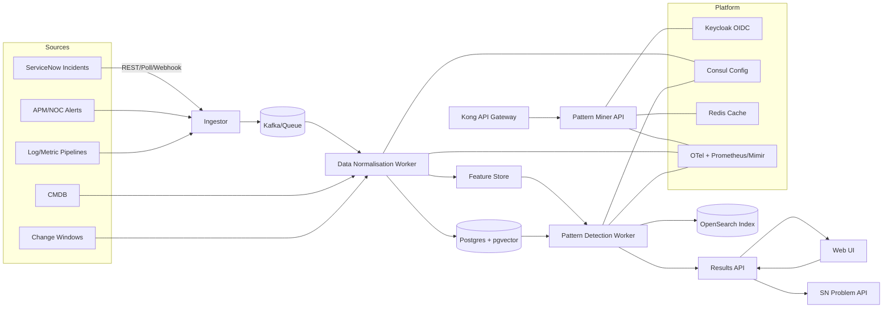
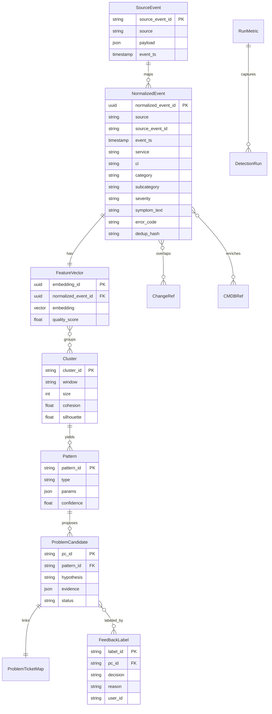
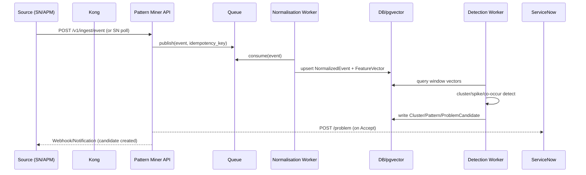

# ITIL Pattern Miner Agent — Technical Specification (v0.1)

**Owner:** Spec Agent • **Date:** 2025‑08‑27 • **Status:** Draft

## 1) Goal & Scope

Design an **ITIL Pattern Miner Agent** composed of two core modules:

1. **Data Normalisation** — ingest heterogeneous ITSM/monitoring data and map to a canonical schema with enrichment & deduplication.
2. **Pattern Detection** — discover clusters/spikes/recurrences to propose **Problem** candidates with evidence for human confirmation and automated creation in ITSM.

**Primary integration target:** ServiceNow (SN) for Incidents/Problems; optional sources include APM/NOC alerts, logs, metrics, CMDB, Change, and knowledge base (KB).

---

## 2) Functional Specifications

### FS‑1. Ingest & Normalise

- **Inputs:** Incidents (SN), alerts (APM/NOC), log/metric events, change windows, CMDB CIs.
- **Actions:**
  - Map source payloads to **Canonical Event** schema.
  - Enrich with CI/service ownership, change window proximity, geo/tenant, and dedup (hash).
  - Generate **text embeddings** for title/description/symptoms (pluggable embedder via LiteLLM or local model).
- **Outputs:** `normalized_event` records + `feature_vector` rows.
- **Acceptance:** ≥ 99% parse success over gold set; duplicates reduced by ≥ 60% vs raw; p95 normalisation latency ≤ 1s/event.

### FS‑2. Cluster & Detect Patterns

- **Techniques:**
  - **Similarity clustering** (cosine over embeddings; HDBSCAN/DBSCAN);
  - **Spike detection** (EWMA or STL residuals) per service/CI/category;
  - **Co‑occurrence mining** (frequent field combinations: CI×symptom×region);
  - **Temporal sequences** (incident → change → incident chains) and recurrence.
- **Outputs:** `cluster`, `pattern`, and `problem_candidate` objects with evidence.
- **Acceptance:** Cluster purity ≥ 0.8 on labeled set; false‑positive rate for problem candidates ≤ 10% after feedback learning.

### FS‑3. Problem Candidate Lifecycle

- Generate human‑readable **Problem hypothesis** (summary, scope, impact, recurrence, related CIs/changes, KB links).
- Allow **analyst feedback**: accept/reject/merge/snooze → becomes training labels.
- Auto‑create/update **Problem** in SN with attached evidence pack.
- **Acceptance:** Time‑to‑Problem creation reduced ≥ 50% on pilot domains; audit trail 100% complete.

### FS‑4. UX & Reporting

- **Dashboards:** Active clusters, top patterns, problem candidates, trendlines, ROI.
- **Detail views:** Cluster composition, timelines, CI topology, change overlap, KB matches.
- **Config UIs:** Mapping editor for normalisation; thresholds for detectors; routing rules for Problem creation.

### FS‑5. Governance, Security, Compliance

- OIDC (Keycloak) with RBAC (Viewer/Analyst/Owner/Admin).
- PII redaction for free‑text before storage & embedding.
- Full **trace_id / span_id** propagation; immutable audit log.

---

## 3) UI / UX Flow

```mermaid
flowchart TD
  A[Login (OIDC)] --> B[Home Dashboard]
  B --> C[Clusters List]
  C --> D[Cluster Detail]
  D --> E[Propose Problem Candidate]
  E --> F{Analyst Decision}
  F -- Accept --> G[Create/Link Problem in SN]
  F -- Reject --> H[Label Feedback]
  F -- Snooze --> I[Defer with reason]
  B --> J[Problem Candidates]
  J --> D
  B --> K[Normalization Mapping Editor]
  B --> L[Detector Settings]
  B --> M[Data Sources / Webhooks]
```

**Wireframe notes**

- **Dashboard:** KPIs (ingested, normalized %, active clusters, new candidates), top contributing CIs/services, sparkline of incident volume, value saved.
- **Cluster Detail:** Similar tickets panel, temporal heatmap, CI/change overlay, evidence pack preview, Problem draft composer.
- **Mapping Editor:** Source field → Canonical field mappings with test‑on‑sample.

---

## 4) Technical Specifications

### 4.1 Architecture Overview



**Deployment:** Containers (Docker), Helm on GKE; autoscale workers; node pools with taints for compute jobs.

**Observability:** OpenTelemetry tracing; metrics exported to Prometheus/Mimir; logs shipped to OpenSearch with correlation ids.

**Resilience:** Exactly‑once semantics via idempotency keys; retry with backoff; DLQ for poison messages; circuit breakers when SN is degraded.

### 4.2 Canonical Event Schema (Normalized)

```json
{
  "normalized_event_id": "uuid",
  "source": "servicenow|apm|log|metric",
  "source_event_id": "string",
  "ingest_ts": "RFC3339",
  "event_ts": "RFC3339",
  "tenant": "string",
  "service": "string",
  "ci": "string",
  "severity": "critical|high|medium|low",
  "category": "string",
  "subcategory": "string",
  "symptom_text": "string",
  "error_code": "string|null",
  "region": "string|null",
  "tags": ["string"],
  "change_window_ids": ["string"],
  "kb_refs": ["string"],
  "embedding_id": "uuid",
  "dedup_hash": "sha256",
  "attributes": { "any": "additional key/values" }
}
```

**Dedup hash:** SHA‑256 over `(source, source_event_id)`, or fallback over `(service, ci, error_code, bucketed_ts, symptom_text_norm)`.

### 4.3 Embedding & Similarity

- Pluggable embedder behind **LiteLLM** (text/vector API). Store vectors in **pgvector**.
- Similarity: cosine; default threshold **0.85**; adaptive per service/CI via feedback.

### 4.4 Detection Methods

- **Clustering:** HDBSCAN/DBSCAN on embeddings within sliding windows (e.g., 6h) with min_samples configurable.
- **Spikes:** EWMA on incident counts; alert when residual > `k·σ` (default k=3) and N≥min_count.
- **Co‑occurrence:** Apriori on categorical fields; support top‑K itemsets with lift/conviction.
- **Temporal sequences:** Change proximity (±2h) increases likelihood weight; recurring weekly patterns flagged by seasonal decomposition.

#### 4.4.1 Standard K-means Clustering Pattern (Demo Implementation)

For demonstration and rapid prototyping scenarios, a simplified clustering approach using scikit-learn:

**Implementation Pattern:**

```python
from sklearn.feature_extraction.text import TfidfVectorizer
from sklearn.cluster import KMeans
from typing import List
from common.models import NormalizedLog, PatternCluster

def apply_clustering(data: List[NormalizedLog]) -> List[PatternCluster]:
    # Step 1: Extract message templates for vectorization
    messages = [log.message_template for log in data]

    # Step 2: TF-IDF Vectorization
    vectorizer = TfidfVectorizer(max_features=1000, stop_words='english')
    X = vectorizer.fit_transform(messages)

    # Step 3: K-means clustering (5 clusters)
    kmeans = KMeans(n_clusters=5, random_state=42)
    cluster_labels = kmeans.fit_predict(X)

    # Step 4: Format results into PatternCluster objects
    clusters = []
    for cluster_id in range(5):
        cluster_logs = [log for i, log in enumerate(data) if cluster_labels[i] == cluster_id]
        if cluster_logs:
            # Find most representative message (closest to centroid)
            representative_msg = find_representative_message(cluster_logs, kmeans.cluster_centers_[cluster_id])

            clusters.append(PatternCluster(
                cluster_id=cluster_id,
                representative_message=representative_msg,
                frequency=len(cluster_logs),
                log_ids=[log.id for log in cluster_logs],
                pattern_template=extract_common_pattern(cluster_logs)
            ))

    return clusters
```

**Key Characteristics:**

- **Vectorization**: TF-IDF on message templates (max 1000 features)
- **Algorithm**: K-means with 5 clusters, fixed random seed for reproducibility
- **Representative Selection**: Message closest to cluster centroid
- **Pattern Extraction**: Common template from clustered messages
- **Output Format**: Standard PatternCluster Pydantic models

**Helper Functions:**

```python
def find_representative_message(cluster_logs: List[NormalizedLog], centroid) -> str:
    """Find the message template closest to the cluster centroid."""
    # Simple implementation: return the most frequent template in cluster
    from collections import Counter
    templates = [log.message_template for log in cluster_logs]
    return Counter(templates).most_common(1)[0][0]

def extract_common_pattern(cluster_logs: List[NormalizedLog]) -> str:
    """Extract common pattern template from clustered logs."""
    # Simple implementation: use the representative message as pattern
    return find_representative_message(cluster_logs, None)
```

**Dependencies Required:**

```
scikit-learn>=1.3.0
numpy>=1.24.0
```

### 4.5 Security & Compliance

- OIDC access tokens (Keycloak) validated at Kong.
- PII redaction (names, emails, phones, IPs if sensitive) before persistence & embedding.
- Encryption in transit (mTLS within cluster optional) and at rest (KMS‑managed).
- Role matrix: Viewer (read‑only), Analyst (label/submit), Owner (create Problems), Admin (config/data export).

### 4.6 Performance Targets

- Ingest ≥ **200 events/sec** sustained per worker pool; horizontal scaling to 2k eps.
- p95 end‑to‑candidate latency ≤ **2 minutes** for hot paths.
- UI p95 API latency ≤ **250 ms** for read endpoints.

---

## 5) Integration Contracts

### 5.1 External (ServiceNow)

- **Auth:** OAuth2 / Basic (per SN instance policy); retries with exponential backoff; rate limit handling.
- **APIs:**
  - `GET /api/now/table/incident?sysparm_query=...`
  - `POST /api/now/table/problem` (on accept)
  - `POST /api/now/attachment` (evidence pack)
  - `GET /api/now/table/cmn_rel_ci` (CI relations) / `cmdb_ci` (enrichment)
- **Contract:** Minimal required fields — `number, sys_id, short_description, description, category, subcategory, cmdb_ci, assignment_group, opened_at, state, priority`.

### 5.2 Ingestion API (Gateway → API)

- **Endpoint:** `POST /v1/ingest/event`
- **Auth:** Bearer (OIDC); `Idempotency-Key` header supported.
- **Body:**

```json
{
  "source": "apm",
  "event_ts": "2025-08-27T09:12:14Z",
  "service": "checkout",
  "ci": "srv-app-42",
  "severity": "high",
  "symptom_text": "503 errors spiking in checkout API",
  "attributes": { "http_5xx": 520, "region": "us-central" }
}
```

- **Responses:** `202 Accepted` with `{"normalized_event_id": "uuid"}` | `409 Conflict` if duplicate.

### 5.3 Results & Query API

- `GET /v1/clusters?window=6h&service=checkout`
- `GET /v1/patterns/{pattern_id}`
- `POST /v1/problem-candidates/{id}:accept` → creates/links SN Problem
- `POST /v1/problem-candidates/{id}:reject` → stores feedback label
- `POST /v1/labels` (bulk human labels for training)

### 5.4 Webhooks

- **Problem Candidate Created:**

```json
{
  "id": "pc_01H...",
  "summary": "Recurring 503s on checkout",
  "cluster_id": "clu_...",
  "evidence_url": "https://.../e/pc_01H",
  "suggested_problem_payload": {
    "short_description": "Recurring 503s – Checkout API",
    "cmdb_ci": "srv-app-42",
    "impact": 2,
    "urgency": 2
  }
}
```

---

## 6) Data Model



**Storage:** Postgres (primary) + pgvector for embeddings; OpenSearch for search; Object storage for evidence packs (JSON/CSV/plots).

---

## 7) Test Strategy & Acceptance Criteria

### 7.1 Testing Pyramid

- **Unit:** mappers/parsers; dedup hash; embedding adapter; detectors (deterministic stubs).
- **Contract:** SN table API (schema assertions), auth flows, idempotency.
- **Integration:** End‑to‑end ingest→normalize→detect with synthetic fixtures; replay historical incidents.
- **Performance:** Load tests to target eps; p95 latency; cluster formation time.
- **Shadow Mode:** Run detectors read‑only; compare to human Problem creation; compute lift/precision/recall.
- **Security:** Token validation, RBAC, PII redaction; secrets scanning.

### 7.2 Acceptance Criteria (excerpt)

- AC‑NORM‑01: Given a valid SN incident, when ingested, then a `normalized_event` exists with mapped fields and non‑empty `dedup_hash`.
- AC‑NORM‑02: Dedup rejects identical events within 10‑minute bucket (409 + same normalized_event_id).
- AC‑DETECT‑01: Similar incidents within 6h window cluster with cosine ≥ 0.85 producing `cohesion ≥ 0.6`.
- AC‑DETECT‑02: Spike detector raises candidate when residual > 3σ and N≥5 in 15‑min bucket.
- AC‑PC‑01: Accepting a candidate creates a Problem in SN and attaches evidence pack.
- AC‑UX‑01: Cluster detail view renders <500ms server time with pagination.
- AC‑GOV‑01: Every candidate has audit trail (who/when/decision) and trace_id linking.

---

## 8) Key Workflows (Sequences)

### 8.1 Ingest → Normalize → Detect → Problem



---

## 9) Configuration & Operations

- **Runtime config:** Consul KV — thresholds, windows, model provider, min_samples.
- **Feature flags:** enable/disable detectors; safe‑mode (no problem creation).
- **CI/CD:** Helm charts; blue/green rollouts; database migrations via Flyway.
- **Runbooks:** DLQ drain; SN outage fallback; embedding model rollback; reindex clusters.

---

## 10) Risks & Mitigations

- **Noisy data / PII leakage:** strict redaction, allowlist fields, sampling.
- **Drift in incident language:** monitor embedding quality; periodic re‑fit thresholds.
- **Rate limits (SN):** backoff, caching, delta sync, bulk read windows.
- **False positives:** human‑in‑the‑loop labeling; progressive auto‑create only after precision≥0.9 over 2 weeks.

---

## 11) Open Questions

- Preferred embedding model & hosting (Vertex, local, 3rd‑party via LiteLLM)?
- Primary sources for phase‑1 (Incidents only vs Incidents+APM)?
- Tenanting model (per customer vs shared with row‑level security)?

---

## 12) Task Seeds (for Agent Decomposition)

- Scaffold services (API, Ingestor, Normaliser, Detector, UI) with OpenTelemetry.
- Build canonical mapping for ServiceNow incident payload → NormalizedEvent.
- Implement idempotent ingest endpoint with `Idempotency-Key` and dedup hash.
- Integrate LiteLLM adapter; store embeddings in pgvector; add cosine search.
- Implement HDBSCAN clustering job with sliding window.
- Implement spike detector (EWMA) per service/CI with config.
- Create Problem Candidate composer + evidence pack generator.
- ServiceNow client (Problems, Attachments) with retry & rate‑limit handling.
- UI pages: Dashboard, Clusters, Candidate review, Mapping editor, Settings.
- PII redaction middleware + unit tests.
- E2E pipeline test with historical replay fixtures.
- Helm charts + Terraform for secrets, Postgres, OpenSearch index templates.
