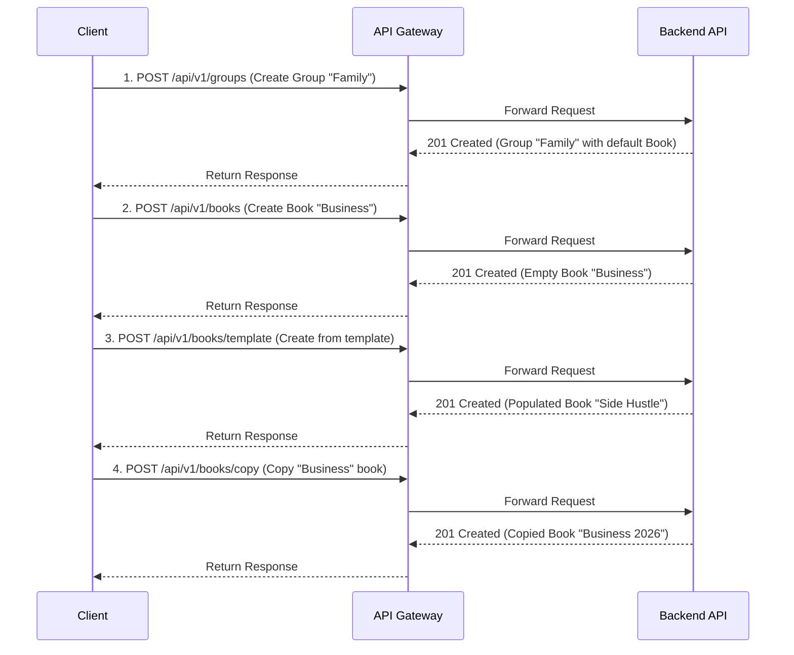

# Product Requirements Document: Moneynote API - Phase 3

## 1. Goal & Scope

**Goal:** To establish the foundational data structures of the application by enabling users to create organizational containers for their financial records.

**Scope:** This phase focuses exclusively on the **creation** of **Groups** and **Books**. It provides the necessary API endpoints for a user to create a new collaborative group and to create financial books within that group using three distinct methods: from scratch, from a predefined template, and by copying an existing book. Management functionalities like updating, deleting, or querying these entities are out of scope for this phase.

---

## 2. Functional Specifications

*   **FS-01: Group Creation:** Authenticated users must be able to create a new `Group`. Creating a group also creates the first `Book` within it, based on a user-selected template.
*   **FS-02: Book Creation (from Scratch):** Users must be able to create a new, empty `Book` within their currently active `Group`. This book will have no predefined categories, tags, or payees.
*   **FS-03: Book Creation (from Template):** Users must be able to create a new `Book` that is pre-populated with a set of `Category`, `Tag`, and `Payee` entities derived from a system-defined template (e.g., "Daily Life").
*   **FS-04: Book Creation (by Copying):** Users must be able to create a new `Book` by duplicating the complete structure (`Category`, `Tag`, and `Payee` entities) of another existing `Book` within the same `Group`.

---

## 3. UI / UX Flow

As this PRD is for the backend API, the UI/UX flow describes the sequence of API calls a client application would make to implement the user-facing features.



---

## 4. Technical Specifications

### 4.1 API Logic

#### **1. `POST /groups`**

*   **Description:** Adds a new `Group` for collaboration and simultaneously creates the first default `Book` inside it from a specified template. The user making the request becomes the owner of the new group.
*   **Business Logic:**
    1.  Validate that the `name` for the new group is not already in use by the user.
    2.  Create a new `Group` entity.
    3.  Create a new `Book` entity using the logic from `POST /books/template`, associating it with the new group.
    4.  Establish a link making the current user the owner of the new group.
    5.  All creation steps must occur within a single database transaction to ensure atomicity.
*   **Request Parameters:**
    *   **Body (`GroupAddForm`):**
        *   `name` (string, mandatory): The name for the new group.
        *   `defaultCurrencyCode` (string, mandatory): The default currency for the group and the first book.
        *   `notes` (string, optional): Descriptive notes for the group.
        *   `templateId` (integer, mandatory): The ID of the book template to use for the initial book.
*   **Responses & Scenarios:**
    *   **201 Created:** Successfully created the group and its default book. The response body contains the details of the new group.
    *   **400 Bad Request:** Validation failed (e.g., `name` or `templateId` is missing).
    *   **409 Conflict:** A group with the same name already exists for the user.
*   **Database CRUD:**
    *   `INSERT` into `t_user_group`.
    *   `INSERT` into `t_user_book`.
    *   `INSERT` into `t_user_category`, `t_user_tag`, `t_user_payee` based on the template.
    *   `INSERT` into a user-group association table (e.g., `t_user_group_relation`).
*   **Database SQL (Conceptual):**
    ```sql
    BEGIN TRANSACTION;
    INSERT INTO t_user_group (name, notes, default_currency_code, owner_id) VALUES (?, ?, ?, ?);
    -- Get new group_id
    INSERT INTO t_user_book (name, group_id, default_currency_code) VALUES (?, ?, ?);
    -- Get new book_id
    -- Loop through template items and INSERT into t_user_category, t_user_tag, etc.
    INSERT INTO t_user_group_relation (user_id, group_id, role) VALUES (?, ?, 'OWNER');
    COMMIT;
    ```

#### **2. `POST /books`**

*   **Description:** Adds a new, empty `Book` to the user's currently active `Group`.
*   **Business Logic:**
    1.  Identify the user's active `Group` from the session context.
    2.  Validate that the `name` for the new book is unique within that `Group`.
    3.  Create and persist a new `Book` entity, associating it with the active `Group`.
*   **Request Parameters:**
    *   **Body (`BookAddForm`):**
        *   `name` (string, mandatory): The name for the new book.
        *   `defaultCurrencyCode` (string, mandatory): The default currency for the book.
        *   `notes` (string, optional): Descriptive notes.
        *   `sort` (integer, optional): A number for sorting purposes.
*   **Responses & Scenarios:**
    *   **201 Created:** Successfully created the book. Response body contains the new book's details.
    *   **400 Bad Request:** Validation failed (e.g., `name` is missing).
    *   **409 Conflict:** A book with the same name already exists in the current group.
*   **Database CRUD:**
    *   `SELECT` from `t_user_group` to confirm the user's context.
    *   `SELECT` from `t_user_book` to check for name uniqueness within the group.
    *   `INSERT` into `t_user_book`.
*   **Database SQL (Conceptual):**
    ```sql
    INSERT INTO t_user_book (name, group_id, default_currency_code, notes, sort) VALUES (?, ?, ?, ?, ?);
    ```

#### **3. `POST /books/template`**

*   **Description:** Adds a new `Book` to the user's active `Group`, pre-populated with entities from a system template.
*   **Business Logic:**
    1.  Identify the user's active `Group`.
    2.  Validate that the new book's `name` is unique within the `Group`.
    3.  Load the specified template from the `book_tpl.json` file.
    4.  Create the new `Book` entity.
    5.  In a single transaction, iterate through the template's structure and create new `Category`, `Tag`, and `Payee` records, linking them to the new book's ID.
*   **Request Parameters:**
    *   **Body (`BookAddByTemplateForm`):**
        *   `templateId` (integer, mandatory): The ID of the template to use.
        *   `book` (`BookAddForm`, mandatory): The details for the new book (name, currency, etc.).
*   **Responses & Scenarios:**
    *   **201 Created:** Successfully created the book and its structure.
    *   **400 Bad Request:** Validation failed.
    *   **404 Not Found:** The provided `templateId` does not exist.
*   **Database CRUD:**
    *   `INSERT` into `t_user_book`.
    *   `INSERT` into `t_user_category` for each category in the template.
    *   `INSERT` into `t_user_tag` for each tag in the template.
    *   `INSERT` into `t_user_payee` for each payee in the template.
*   **Database SQL (Conceptual):**
    ```sql
    BEGIN TRANSACTION;
    INSERT INTO t_user_book (...) VALUES (...);
    -- Get new book_id
    INSERT INTO t_user_category (book_id, name, type, ...) VALUES (?, ?, ?, ...); -- Repeat for all categories
    INSERT INTO t_user_tag (book_id, name, ...) VALUES (?, ?, ...); -- Repeat for all tags
    INSERT INTO t_user_payee (book_id, name, ...) VALUES (?, ?, ...); -- Repeat for all payees
    COMMIT;
    ```

#### **4. `POST /books/copy`**

*   **Description:** Adds a new `Book` by duplicating the structure (`Category`, `Tag`, `Payee`) of an existing `Book`.
*   **Business Logic:**
    1.  Identify the user's active `Group`.
    2.  Validate that the source `bookId` exists and belongs to the user's `Group`.
    3.  Validate that the new book's `name` is unique within the `Group`.
    4.  Create the new `Book` entity.
    5.  In a single transaction, select all `Category`, `Tag`, and `Payee` records from the source book and insert copies linked to the new book's ID.
*   **Request Parameters:**
    *   **Body (`BookAddByBookForm`):**
        *   `bookId` (integer, mandatory): The ID of the book to copy from.
        *   `book` (`BookAddForm`, mandatory): The details for the new book (name, currency, etc.).
*   **Responses & Scenarios:**
    *   **201 Created:** Successfully created the copied book.
    *   **400 Bad Request:** Validation failed.
    *   **404 Not Found:** The source `bookId` does not exist or does not belong to the user's group.
*   **Database CRUD:**
    *   `SELECT` from `t_user_book` to get the source book.
    *   `SELECT` from `t_user_category` where `book_id` is the source book's ID.
    *   `SELECT` from `t_user_tag` where `book_id` is the source book's ID.
    *   `SELECT` from `t_user_payee` where `book_id` is the source book's ID.
    *   `INSERT` into `t_user_book` (the new book).
    *   `INSERT` new records into `t_user_category`, `t_user_tag`, and `t_user_payee`.
*   **Database SQL (Conceptual):**
    ```sql
    BEGIN TRANSACTION;
    -- Create the new book record
    INSERT INTO t_user_book (name, group_id, ...) VALUES (?, ?, ...);
    -- Get the new_book_id
    -- Copy categories
    INSERT INTO t_user_category (book_id, name, type, p_id, sort, notes)
    SELECT ?, name, type, p_id, sort, notes FROM t_user_category WHERE book_id = ?; -- ? is new_book_id, ? is source_book_id
    -- (Similar INSERT...SELECT statements for tags and payees)
    COMMIT;
    ```

---

## 5. Data Model

This phase impacts the `Group` and `Book` entities.

**Table: `t_user_group`**

| Column | Data Type | Constraints | Description |
|---|---|---|---|
| `id` | `INTEGER` | PRIMARY KEY | Unique identifier for the group. |
| `name` | `VARCHAR(64)` | NOT NULL | Name of the group. |
| `owner_id` | `INTEGER` | FK -> t_user_user(id) | The user who owns the group. |
| `default_currency_code` | `VARCHAR(8)` | NOT NULL | Default currency for the group. |
| `notes` | `VARCHAR(1024)` | | Optional descriptive notes. |

**Table: `t_user_book`**

| Column | Data Type | Constraints | Description |
|---|---|---|---|
| `id` | `INTEGER` | PRIMARY KEY | Unique identifier for the book. |
| `name` | `VARCHAR(64)` | NOT NULL | Name of the book, unique per group. |
| `group_id` | `INTEGER` | NOT NULL, FK -> t_user_group(id) | The group this book belongs to. |
| `default_currency_code` | `VARCHAR(8)` | NOT NULL | Default currency for reporting within this book. |
| `notes` | `VARCHAR(1024)` | | Optional descriptive notes. |
| `enable` | `BOOLEAN` | NOT NULL, DEFAULT true | Flag to enable or disable the book. |
| `sort` | `INTEGER` | | An integer for sorting the list of books. |

---

## 6. Test Cases

| Test Case ID | API Endpoint | Feature Tested | Test Steps | Expected Result |
|---|---|---|---|---|
| **TC-P3-01** | `POST /groups` | Happy Path: Create a new group | 1. Send a valid `GroupAddForm` payload. | A `201 Created` response is returned with the new group's details. A default book is created within the group. |
| **TC-P3-02** | `POST /books` | Happy Path: Create a book from scratch | 1. Send a valid `BookAddForm` payload. | A `201 Created` response is returned. The new book is empty of categories, tags, or payees. |
| **TC-P3-03** | `POST /books/template` | Happy Path: Create book from template | 1. Send a valid `BookAddByTemplateForm` with a valid `templateId`. | A `201 Created` response is returned. The new book contains all entities defined in the template. |
| **TC-P3-04** | `POST /books/copy` | Happy Path: Create book by copying | 1. Send a valid `BookAddByBookForm` with a valid source `bookId`. | A `201 Created` response is returned. The new book has a structure identical to the source book. |
| **TC-P3-05** | `POST /books` | Negative Path: Duplicate book name | 1. Attempt to create a book with a name that already exists in the current group. | A `409 Conflict` error is returned. The book is not created. |
| **TC-P3-06** | `POST /books/template` | Negative Path: Invalid template ID | 1. Send a request with a `templateId` that does not exist. | A `404 Not Found` error is returned. |
| **TC-P3-07** | `POST /books/copy` | Negative Path: Invalid source book ID | 1. Send a request with a source `bookId` that does not exist. | A `404 Not Found` error is returned. |

---

## 7. Risks & Mitigations

*   **Risk:** Data inconsistency if the creation process (e.g., copying a book) fails midway.
    *   **Mitigation:** All multi-step database operations must be wrapped in a single, atomic transaction. A failure at any step should roll back all previous steps.
*   **Risk:** Poor performance when copying a book with thousands of associated categories, tags, or payees.
    *   **Mitigation:** Implement bulk insert operations (`INSERT INTO ... SELECT FROM ...`) instead of iterating and inserting one by one. For extreme cases, consider an asynchronous job queue.
*   **Risk:** The `book_tpl.json` file could be missing, corrupt, or contain invalid data, breaking the template creation feature.
    *   **Mitigation:** The application should validate the schema and content of `book_tpl.json` on startup and log errors if it's invalid. The endpoint should gracefully handle a missing template.

---

## 8. Open Questions

1.  What is the exact schema for the `book_tpl.json` file?
2.  Are there any business rules regarding the nesting depth of categories that need to be handled during template creation or copying?
3.  What should be the system's behavior if a user attempts to copy a book from a group they do not have access to? (Assume 404 Not Found for now).

---

## 9. Task Seeds (for Agent Decomposition)

*   `task: Implement POST /groups endpoint`
    *   `subtask: Create GroupAddForm validation.`
    *   `subtask: Implement Group creation service logic, including transactional creation of the default book.`
    *   `subtask: Write unit and integration tests for group creation.`
*   `task: Implement POST /books endpoint`
    *   `subtask: Create BookAddForm validation.`
    *   `subtask: Implement service logic to create an empty book in the current group.`
    *   `subtask: Write unit and integration tests.`
*   `task: Implement POST /books/template endpoint`
    *   `subtask: Implement logic to load and parse book_tpl.json.`
    *   `subtask: Implement service logic to transactionally create a book and populate it from a template.`
    *   `subtask: Write unit and integration tests.`
*   `task: Implement POST /books/copy endpoint`
    *   `subtask: Implement service logic to transactionally create a book and duplicate entities from a source book.`
    *   `subtask: Use efficient bulk-insert statements for copying.`
    *   `subtask: Write unit and integration tests.`

## Completed Task so far

The following task have been executed and completed, do not repeat them, assume their output is ready for use for tasks in the future:
- [✔] Configure Version and Base URL Settings
- [✔] Create Static Data Files and Pydantic Schemas
- [✔] Implement Data Loading Service for Static Files
- [✔] Integrate Data Loading Service at Application Startup
- [✔] Implement `GET /version` and `GET /test3` Endpoints
- [✔] Implement `GET /currencies/all` Endpoint
- [✔] Implement `GET /book-templates/all` Endpoint
- [✔] Apply JWT Authentication to All Phase 1 Endpoints
- [✔] Write Integration Tests for System and Currency Endpoints
- [✔] Write Integration Tests for Book Templates Endpoint- [✔] Define Schema and Router for `PUT /bind`
- [✔] Implement CRUD Functions for User Binding
- [✔] Implement Core Service Logic for `PUT /bind`
- [✔] Create Invitation Model, CRUD, and Migration
- [✔] Integrate Invite Code Validation and Password Hashing
- [✔] Write Integration Tests for `PUT /bind` Endpoint
- [✔] Define Pydantic Schemas for `GET /initState`
- [✔] Implement `GET /initState` Endpoint and Service Logic
- [✔] Verify and Add CRUD Functions for `initState`
- [✔] Write Integration Tests for `GET /initState` Endpoint# Moneynote API - Detailed Design Document

## 1. Introduction

This document provides a detailed design for the new Moneynote backend API. It is based on the API definition, dependencies, development plan, and the overarching architecture principles provided for the project. The goal is to create a robust, scalable, and maintainable API that serves as the backbone for the Moneynote application.

## 2. Overall Architecture

The API will be built using Python and the FastAPI framework, following a layered architecture pattern to ensure a clean separation of concerns.

### 2.1. Tech Stack

*   **Backend Framework**: FastAPI
*   **Programming Language**: Python
*   **Database**: SQLite3
*   **ORM**: SQLAlchemy
*   **File/Object Storage**: Google Cloud Storage (GCS)
*   **Package Management**: `uv`

### 2.2. Layered Architecture

The application will be structured into three main layers:

1.  **API/Presentation Layer (`routers`)**: This layer is responsible for handling HTTP requests and responses. It defines the API endpoints, receives incoming data, and uses the service layer to perform actions. It relies on Pydantic schemas for data validation and serialization.

2.  **Business Logic Layer (`services`)**: This layer contains the core application logic. It orchestrates operations, enforces business rules, and coordinates between the data access layer and other services. It is completely decoupled from the HTTP transport layer.

3.  **Data Access Layer (`crud`)**: This layer is responsible for all communication with the database. It contains functions for creating, reading, updating, and deleting records (CRUD), using SQLAlchemy as the ORM. This isolates the rest of the application from the specifics of the database implementation.

### 2.3. API and Deployment

*   All API endpoints will be prefixed with `/api/v1`.
*   The application will be deployed as a Google Cloud Run App within a VPC, fronted by an API Gateway and an external load balancer.
*   Due to the use of a single SQLite3 database file, the application is limited to a single running instance and cannot be scaled horizontally.

## 3. Design Considerations

### 3.1. Statelessness

Following the architecture principles, the backend API will be stateless. No application state or user session data will be held in memory on the server. This is crucial for reliability and simplifies deployment.

### 3.2. Authentication and Authorization

*   **Authentication**: The API will not handle user authentication (e.g., password validation or JWT issuance). It will rely on an external Identity Provider and an API Gateway to validate JWTs.
*   **User Identity**: The backend will receive the user's identity from the `sub` claim within the validated JWT, passed in the `Authorization: Bearer <token>` header.
*   **Auto-Registration**: If a request is received with a `sub` claim for a user that does not exist in the database, a new user record will be created automatically.
*   **Authorization**: The API will implement resource-level authorization. Business logic in the service layer will check if the authenticated user (from the JWT) has the necessary permissions to access or modify a given resource (e.g., can User A access Book B?).
*   **403 Response**: If a required JWT is missing, the API will return a `403 Forbidden` status code.

### 3.3. Data Validation

*   All incoming data will be rigorously validated on the backend. No trust will be placed in frontend validation.
*   FastAPI's integration with Pydantic will be used to define schemas for request bodies and query parameters, ensuring that all incoming data conforms to the required types and constraints before being processed by the application logic.

### 3.4. Configuration

*   Application configuration, especially for external services, will be managed through environment variables.
*   This includes the SQLAlchemy database connection string and the names of Google Cloud Storage buckets for file storage.

### 3.5. Error Handling

The API will use a standardized JSON format for error responses to provide consistent and predictable error information to clients. A middleware component will be implemented to catch exceptions and format them into this standard structure.

Example Error Response:
```json
{
  "detail": "A specific error message explaining what went wrong."
}
```

## 4. API Endpoints

The API exposes a comprehensive set of endpoints for managing all aspects of the Moneynote application. The endpoints are grouped by resource controllers. For a complete and detailed list of all endpoints, request/response models, and parameters, please refer to the **[Moneynote API Definition](./api_definition.md)**.

The primary resource controllers include:
*   **User API**: User login, registration, and session state.
*   **Account API**: Management of financial accounts.
*   **Balance Flow API**: Handling of transactions (income, expense, transfer).
*   **Book API**: Management of accounting books.
*   **Category API**: Management of transaction categories.
*   **Tag API**: Management of transaction tags.
*   **Payee API**: Management of payees.
*   **Group API**: Management of user groups for shared books.
*   **Report API**: Data aggregation and reporting.
*   And others as defined in the API documentation.

## 5. Implementation Plan

The development of the API will follow the phased approach detailed in the **[Moneynote API Development Plan](./api_plan.md)**. This plan organizes the implementation into logical, dependency-aware phases to ensure a smooth development process, starting with foundational endpoints and progressively building more complex features.

## 6. Project and File Structure

The backend project will be organized into a modular structure that reflects the layered architecture described above. This promotes maintainability, testability, and a clear separation of concerns. The proposed structure is as follows:

```
moneynote_api/
├── alembic/                  # Alembic migrations for database schema changes
│   ├── versions/             # Directory for migration script versions
│   └── env.py                # Alembic environment configuration
├── moneynote/
│   ├── __init__.py
│   ├── core/                 # Core application settings and configuration
│   │   ├── __init__.py
│   │   └── config.py         # Pydantic-based settings management (loads from env vars)
│   ├── crud/                 # Data Access Layer: Functions for database CRUD operations
│   │   ├── __init__.py
│   │   ├── crud_user.py
│   │   ├── crud_book.py
│   │   └── ...               # One file per model
│   ├── data/                 # Static data files (e.g., currency lists)
│   ├── models/               # Data Model Layer: SQLAlchemy ORM models
│   │   ├── __init__.py
│   │   ├── user.py
│   │   ├── book.py
│   │   └── ...               # One file per database table
│   ├── routers/              # API/Presentation Layer: FastAPI routers
│   │   ├── __init__.py
│   │   ├── deps.py           # Common dependencies (e.g., get_current_user)
│   │   ├── users.py
│   │   ├── books.py
│   │   └── ...               # One file per resource/controller
│   ├── schemas/              # Pydantic models for validation and serialization
│   │   ├── __init__.py
│   │   ├── user.py
│   │   ├── book.py
│   │   └── ...               # One file per model, with schemas for Create, Update, InDB, etc.
│   ├── services/             # Business Logic Layer: Core application logic
│   │   ├── __init__.py
│   │   ├── user_service.py
│   │   ├── book_service.py
│   │   └── gcs_service.py    # Service for interacting with Google Cloud Storage
│   └── security.py           # Security-related functions (e.g., handling JWT claims)
├── tests/                    # Pytest tests for all layers
│   ├── __init__.py
│   ├── test_main.py
│   └── ...
├── .gitignore
├── database.py               # Database engine and session setup
├── main.py                   # Main FastAPI application entry point and router inclusion
├── pyproject.toml            # Project metadata and dependencies for `uv`
└── README.md                 # Project README
```
