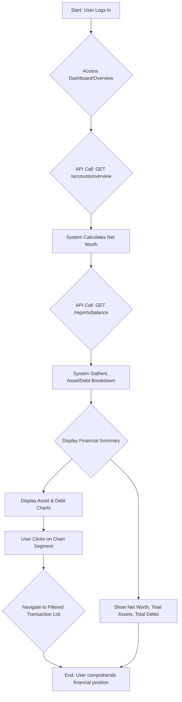

# Journey 1: Monitoring Financial Situation

This document details the user journey for monitoring one's financial situation within the MoneyNote application.

## 1. Detailed User Journeys and Flows

**Objective:** To capture the step-by-step interactions a user has with the system to assess their overall financial health.

### Journey: Reviewing Financial Overview

This journey describes how a user accesses and interprets the primary financial overview, including their net worth, assets, and liabilities.

**Start Point:** User logs into the application.

**End Point:** User has a clear understanding of their current financial standing.

#### Flow Diagram

#### Sequential Description

1.  **Login and Access:** The user logs into the application and is typically presented with a main dashboard or an "Overview" screen.
2.  **System Aggregation (Net Worth):**
    *   **User Action:** The dashboard automatically loads key financial metrics.
    *   **System Response:** The system initiates a backend call to the `/api/v1/accounts/overview` endpoint.
        *   The `AccountService.overview()` method is triggered.
        *   It fetches all accounts categorized as assets (`CHECKING`, `ASSET`) and liabilities (`CREDIT`, `DEBT`).
        *   It converts the balance of each account to the user's default currency.
        *   It calculates Total Assets, Total Liabilities, and Net Worth (Assets - Liabilities).
        *   The calculated totals are returned to the frontend.
3.  **System Aggregation (Chart Data):**
    *   **User Action:** The dashboard simultaneously requests data for visual reports.
    *   **System Response:** The system calls the `/api/v1/reports/balance` endpoint.
        *   The `ReportService.reportBalance()` method is triggered.
        *   It fetches all asset and debt accounts.
        *   It prepares two lists of `ChartVO` objects, one for assets and one for debts, containing the account name and its converted balance.
        *   This data is returned to the frontend, ready for rendering as charts.
4.  **Display and Interpretation:**
    *   **User Action:** The user views the displayed information.
    *   **System Response:** The UI displays:
        *   Prominent cards showing **Total Assets**, **Total Debts**, and **Net Worth**.
        *   Two pie charts or bar charts: one visualizing the composition of assets by account, and another for debts.
5.  **Drill-Down (Optional):**
    *   **User Action:** The user clicks on a specific segment of a chart (e.g., the "Credit Card" slice in the debt pie chart).
    *   **System Response:** The application navigates the user to the transaction list, pre-filtered to show only the transactions associated with that specific account.

## 2. Detailed Object Level Data Structures

### Entity: `Account`

Represents a single financial account.

| Attribute Name | Data Type | Constraints & Properties | Description |
| :--- | :--- | :--- | :--- |
| `id` | `integer` | `PRIMARY KEY`, `NOT NULL` | Unique identifier for the account. |
| `name` | `string` | `NOT NULL` | User-defined name for the account (e.g., "Chase Checking"). |
| `group` | `Group` | `FOREIGN KEY`, `NOT NULL` | The user group this account belongs to. |
| `type` | `AccountType` | `NOT NULL` | Enum indicating the account type (`CHECKING`, `CREDIT`, `ASSET`, `DEBT`). |
| `notes` | `string` | `maxLength: 1024` | Optional descriptive notes. |
| `enable` | `boolean` | `NOT NULL` | Whether the account is active. |
| `no` | `string` | `maxLength: 32` | Optional account number or card number. |
| `balance` | `BigDecimal` | `NOT NULL` | The current balance of the account in its native currency. |
| `include` | `boolean` | `NOT NULL` | If true, this account is included in net worth and other summary calculations. |
| `currencyCode` | `string` | `NOT NULL`, `maxLength: 8` | The currency code for the account (e.g., "USD", "EUR"). |
| `initialBalance`| `BigDecimal`| | The starting balance when the account was created. |
| `creditLimit` | `BigDecimal`| | The credit limit for `CREDIT` type accounts. |

### Enum: `AccountType`

Defines the classification of an account.

| Value | Description |
| :--- | :--- |
| `CHECKING` | A standard transactional account (asset). |
| `CREDIT` | A credit card account (liability). |
| `ASSET` | A general asset account (e.g., investments, property) (asset). |
| `DEBT` | A loan or other liability account (liability). |

### View Object: `ChartVO`

A Data Transfer Object used for sending reporting data to the frontend for visualization.

| Attribute Name | Data Type | Description |
| :--- | :--- | :--- |
| `x` | `string` | The label for the data point (e.g., account name, category name). |
| `y` | `BigDecimal` | The value for the data point (e.g., account balance, total spending). |
| `percent` | `BigDecimal` | The percentage this data point represents out of the total. |

## 3. Database Tables to be Updated

In the "Monitoring Financial Situation" journey, no data is written or updated. The entire flow is **read-only**.

### Tables Read From:

*   **`t_user_account`**: Read extensively to fetch account details, balances, types, and currencies.
*   **`t_user_group`**: Read to determine the user's default currency for conversions.
*   **`t_currency` (In-memory)**: The application maintains an in-memory list of currencies and exchange rates, which is read by the `CurrencyService` for conversions.

## 4. Business Rules and Functionality (Detailed)

### Rule: Net Worth Calculation

*   **Rule Name:** `CalculateNetWorth`
*   **Description:** The system calculates the user's total net worth.
*   **Triggering Event:** A call to the `/api/v1/accounts/overview` endpoint.
*   **Logic/Conditions:**
    1.  Fetch all `enabled` and `included` accounts for the user's group.
    2.  Identify **Assets**: Accounts of type `CHECKING` or `ASSET`.
    3.  Identify **Liabilities**: Accounts of type `CREDIT` or `DEBT`.
    4.  For each account, convert its `balance` to the group's `defaultCurrencyCode` using the `CurrencyService`.
    5.  Calculate `TotalAssets` = Sum of all converted asset balances.
    6.  Calculate `TotalLiabilities` = Sum of all converted liability balances. Note: The balances for `CREDIT` and `DEBT` are typically negative, so the service negates the final sum to represent it as a positive liability value.
    7.  `NetWorth` = `TotalAssets` - `TotalLiabilities`.
*   **Outcome/Action:** An array of three `BigDecimal` values `[TotalAssets, TotalLiabilities, NetWorth]` is returned.

### Rule: Balance Reporting for Charts

*   **Rule Name:** `GenerateBalanceReport`
*   **Description:** The system prepares data structured for visualizing the breakdown of assets and debts.
*   **Triggering Event:** A call to the `/api/v1/reports/balance` endpoint.
*   **Logic/Conditions:**
    1.  Fetch all asset accounts and debt accounts separately.
    2.  For each asset account with a non-zero balance, create a `ChartVO` object:
        *   `x` = account `name`.
        *   `y` = account `balance`, converted to the default currency.
    3.  For each debt account with a non-zero balance, create a `ChartVO` object:
        *   `x` = account `name`.
        *   `y` = account `balance`, converted to the default currency and **negated** to be shown as a positive value.
    4.  Calculate the percentage contribution of each `ChartVO` relative to its group (asset or debt).
*   **Outcome/Action:** A list containing two lists of `ChartVO` objects `[[assetChart], [debtChart]]` is returned.

### Validations

*   **Backend Validations:** Since this is a read-only journey, there are no input validations. The primary implicit validation is ensuring that accounts belong to the user's active group, which is handled by the `SessionUtil` and repository query predicates.

## 5. Detailed Test Cases

| Test Case ID | Feature Being Tested | Preconditions | Test Steps | Test Data | Expected Result |
| :--- | :--- | :--- | :--- | :--- | :--- |
| **TC-MON-01** | **Happy Path - Net Worth** | User has 2 asset accounts and 1 debt account. Group currency is USD. | 1. Log in.   2. Make a GET request to `/accounts/overview`. | - Account A (Asset, USD): 1000.00   - Account B (Asset, EUR): 500.00 (Rate: 1 EUR = 1.2 USD)   - Account C (Debt, USD): -200.00 | API returns `[1600.00, 200.00, 1400.00]`. (Assets: 1000 + 500*1.2 = 1600. Debts: 200. Net Worth: 1400). |
| **TC-MON-02** | **Boundary - Zero Balances** | User has accounts, but all have a balance of 0. | 1. Log in.   2. Make a GET request to `/accounts/overview`. | - Account A (Asset, USD): 0.00   - Account C (Debt, USD): 0.00 | API returns `[0.00, 0.00, 0.00]`. |
| **TC-MON-03** | **Boundary - Account Excluded** | User has an asset account marked with `include=false`. | 1. Log in.   2. Make a GET request to `/accounts/overview`. | - Account A (Asset, USD, `include=true`): 1000.00   - Account B (Asset, USD, `include=false`): 5000.00 | API returns `[1000.00, 0.00, 1000.00]`. Account B is ignored. |
| **TC-MON-04** | **Negative Path - No Accounts** | User has no accounts created. | 1. Log in.   2. Make a GET request to `/accounts/overview`. | N/A | API returns `[0.00, 0.00, 0.00]`. |
| **TC-MON-05** | **Happy Path - Balance Report** | User has multiple asset and debt accounts. | 1. Log in.   2. Make a GET request to `/reports/balance`. | - Account A (Asset, USD): 800   - Account B (Asset, USD): 200   - Account C (Debt, USD): -300   - Account D (Debt, USD): -100 | API returns two lists of `ChartVO`.   - Asset list contains A (y=800, p=80%) and B (y=200, p=20%).   - Debt list contains C (y=300, p=75%) and D (y=100, p=25%). |

## 6. State Any Assumptions

*   **Currency Rates are Available:** It is assumed that the `CurrencyService` has a valid exchange rate for any conversions required. If a rate is missing between a source currency and the default currency, the conversion will fail.
*   **User Group Context:** All calculations are performed within the context of the user's currently active `Group`. The system correctly identifies this group from the user's session.
*   **Correct Account Typing:** It is assumed that users have correctly classified their accounts as `ASSET`, `DEBT`, `CHECKING`, or `CREDIT`. The accuracy of the financial overview is entirely dependent on this classification.

